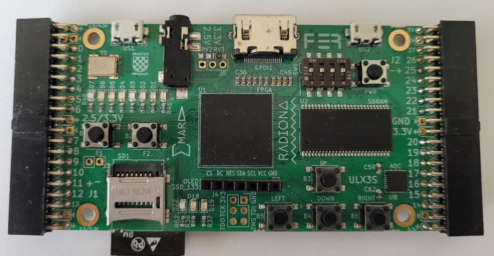
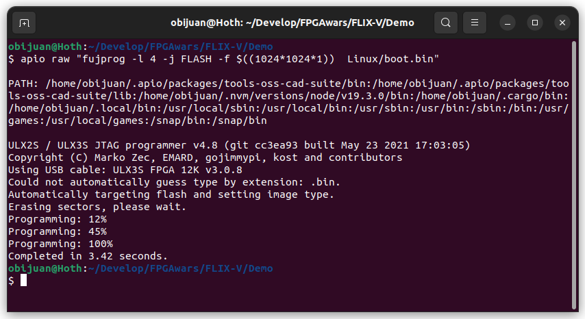
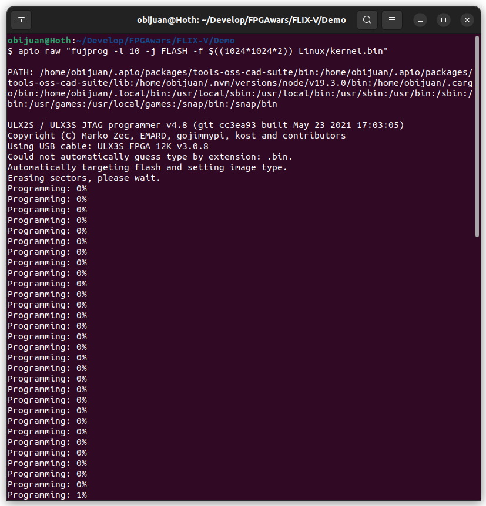
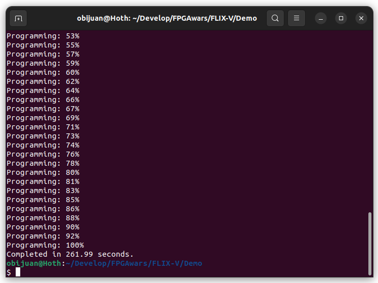
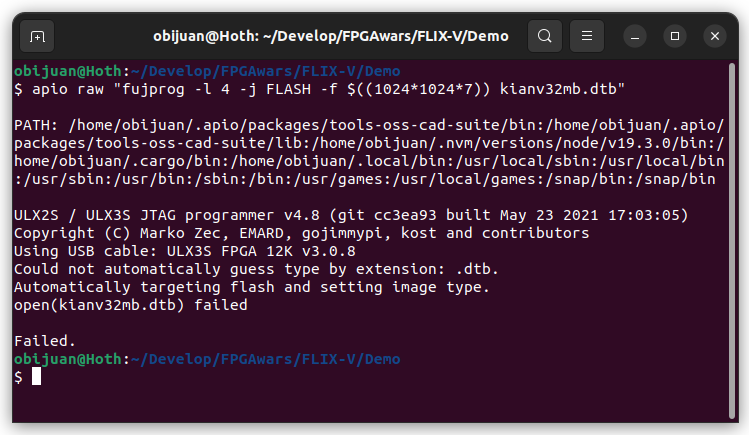
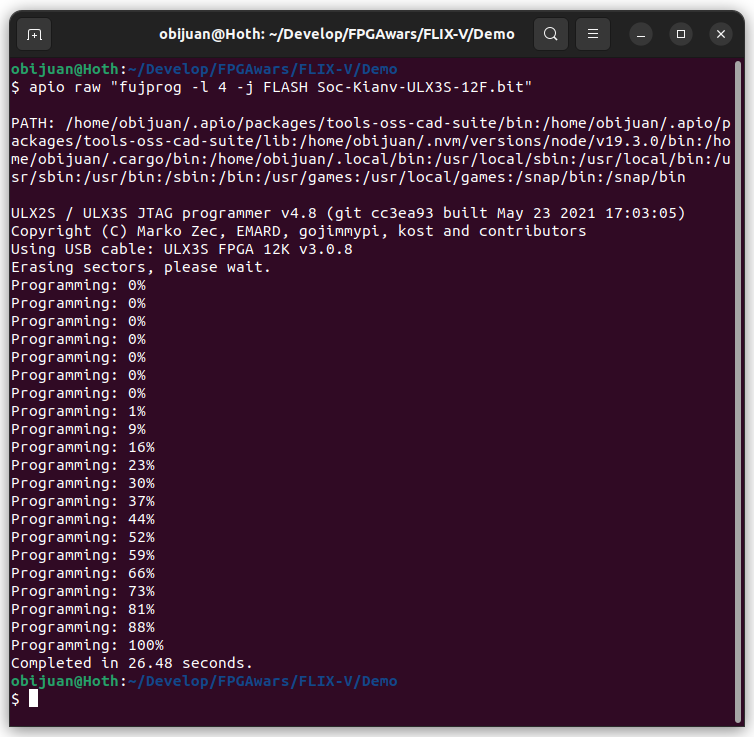
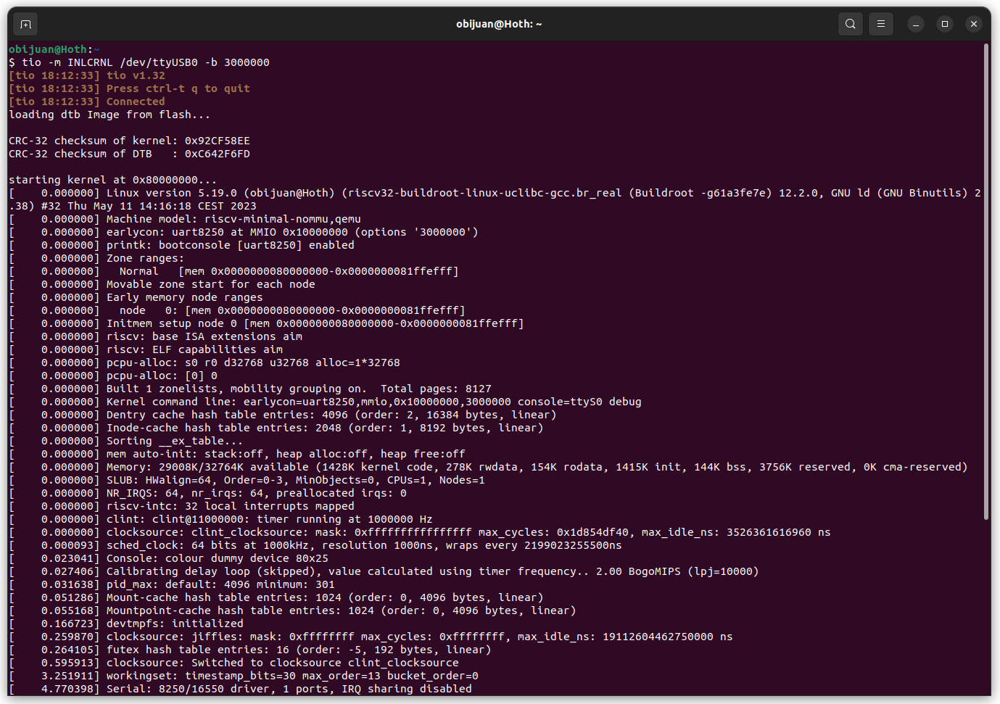
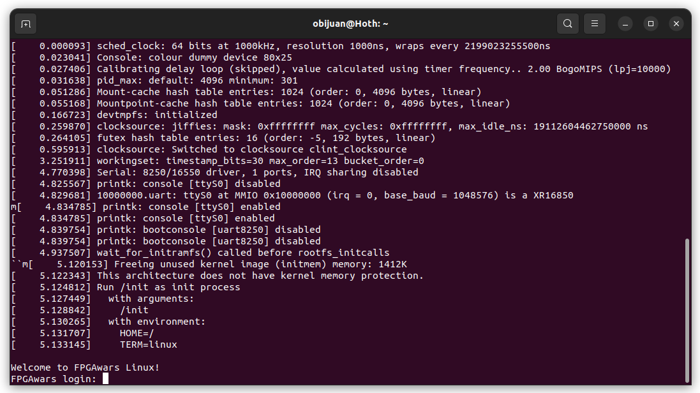
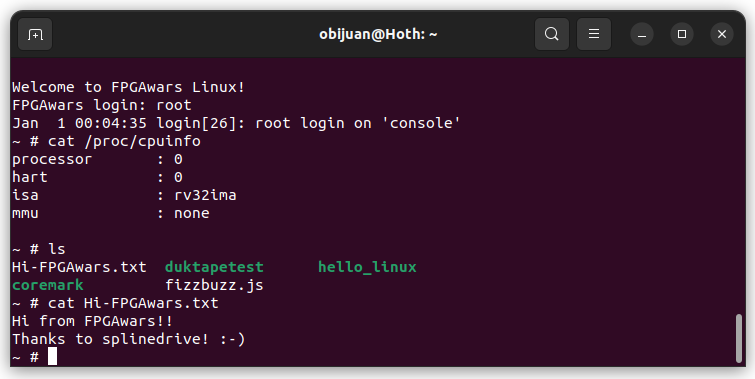

# Running Linux on the FPGA board

If you want to try Linux on your FPGA board, follow these steps

## Requerements

* Install [APIO](https://github.com/FPGAwars/apio/wiki)
* **Board**: [Radiona ULX3S-12F](https://radiona.org/ulx3s/)




## Step 1: Flashing linux

Linux is composed of 3 parts that are written into the flash memory at different addresses

* **0x100000** (1024\*1024, 1MB). **Boot**. File: `boot.bin`
* **0x200000** (1024\*1024\*2, 2MB), **Kernel**. File: `kernel.bin`
* **0x700000** (1024\*1024\*7), 7MB), **DTB**. File: `kianv32mb.dtb`

## Step 1.1: Flash the Bootloader

This program is in charge of preparing and initilizing the system for running the linux kernel

* Command:

```
apio raw "fujprog -l 4 -j FLASH -f $((1024*1024*1))  Linux/boot.bin"
```


## Step 1.2: Flash the Kernel

* Command:

```
apio raw "fujprog -l 10 -j FLASH -f $((1024*1024*2)) kernel.bin"
```





This process takes around 4 minutes

## Step 1.3: Flash the DTB Image

The DTB (Device Tree Blob) is a binary that contains information about the hardware configuration: devices, system resources, peripherals....

```
apio raw "fujprog -l 4 -j FLASH -f $((1024*1024*7)) kianv32mb.dtb"
```




# Step 2: Flashing the KianV bitstream

Finally, let's add the KianV Risc-v soc

* Command:

```
apio raw "fujprog -l 4 -j FLASH Soc-Kianv-ULX3S-12F.bit"
```



# Step 3: Running Linux!

After flashing the Kianv soc, Linux will boot. 


Open a serial terminal configured for the custom speed of **3000000 bauds**

A very simple and useful terminal for linux is [tio](https://github.com/tio/tio)

* Command:

```
tio -m INLCRNL /dev/ttyUSB0 -b 3000000
```






Now log in as root:



... and you are now ready to feel the power of Linux running on the FPGA...

* Youtube videos:

[](https://www.youtube.com/watch?v=X3PfOpjIHhs)

[](https://www.youtube.com/watch?v=X3PfOpjIHhs)

