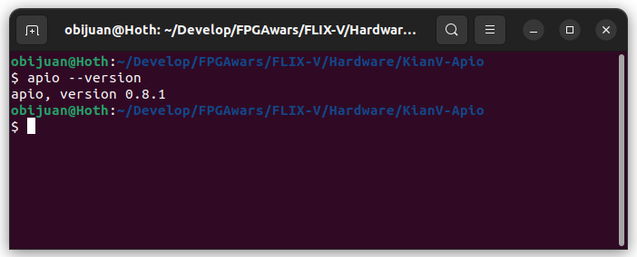
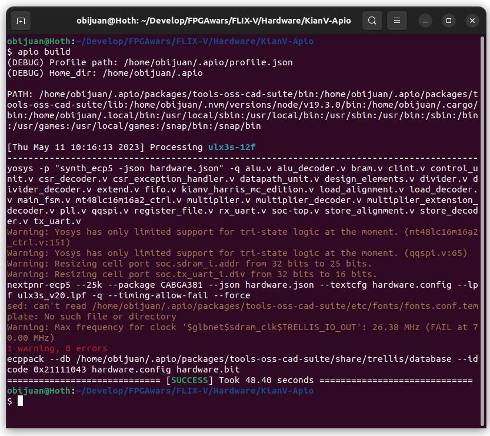
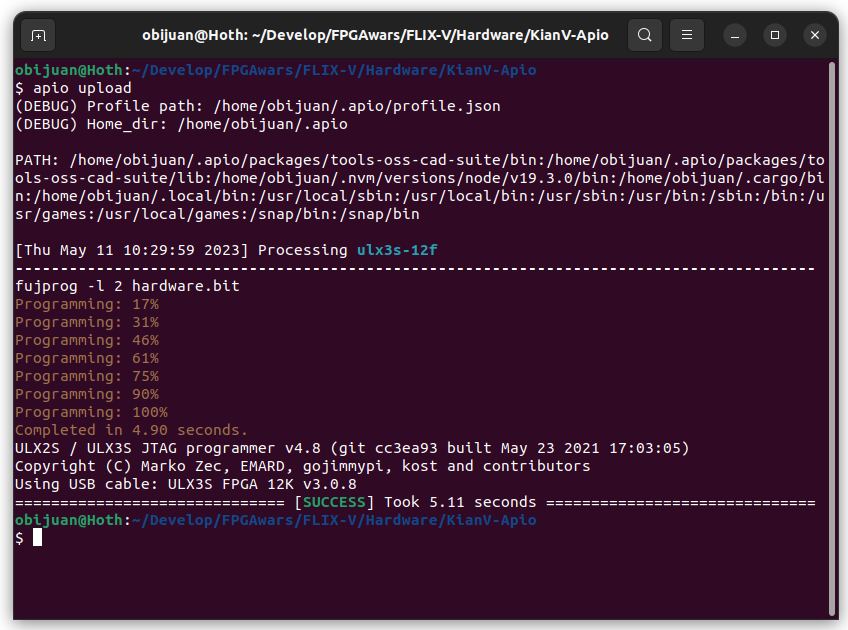

# Synthesizing KianV with apio

* Default board: Radiona ULX3S-12F board

1. **Install** [Apio](https://github.com/FPGAwars/apio/wiki)
2. It has been tested with Apio 0.8.1:

* Command:

```
apio --version
```



3. **Synthesize the KianV processor**

* Command:

```
apio build
```



It takes around 50 seconds (on my machine). When it is done, the bitstream is generated in the file `hardware.bit`

4. **Upload the bitstream to the FPGA**

* Command:

```
apio upload
```


