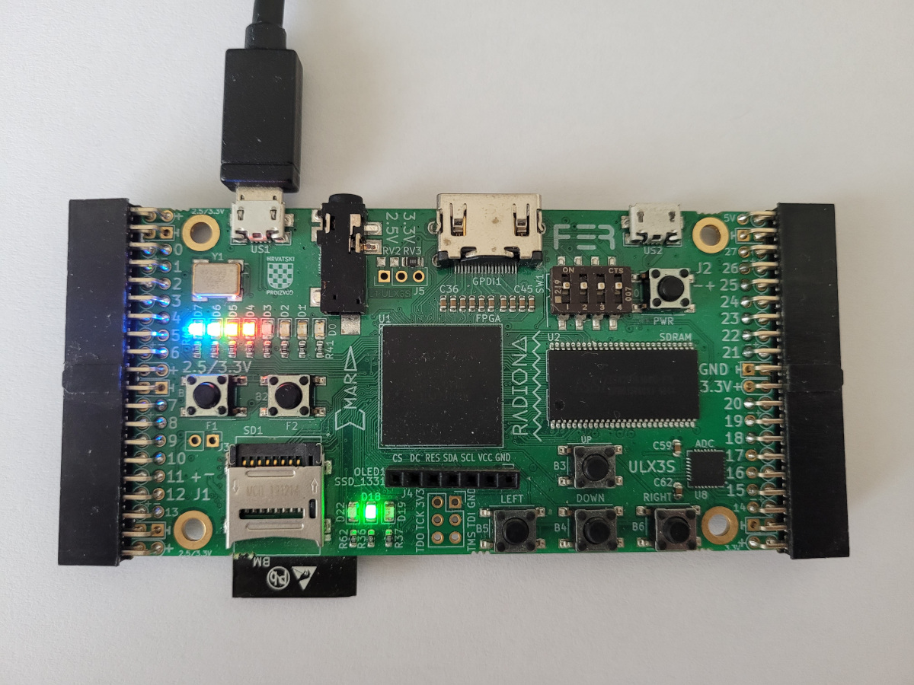
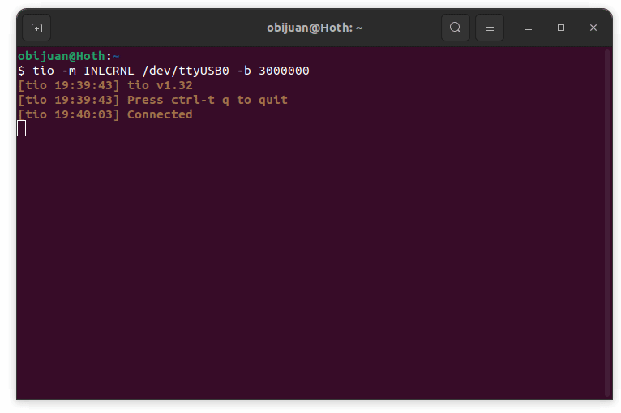

# FLIX-V
FLIX-V: FPGA, Linux and RISC-V

Learning about how to run Linux on no-mmu RISC-V processors on Open Source FPGAs  
It is amazing how now we can learn what is happening from the bits to the Linux

It was a dream to run Linux (open source software) on a Open source processor (RISC-V). Everything build with open source tools (the hardware and the software). It also amazing to see it running on open hardware boards, that in turn, have been designed using open source tools

* **Board**: [Radiona ULX3S-12F](https://radiona.org/ulx3s/)

## Credits
* Based on this work: [KianRiscV](https://github.com/splinedrive/kianRiscV) by @splinedrive

